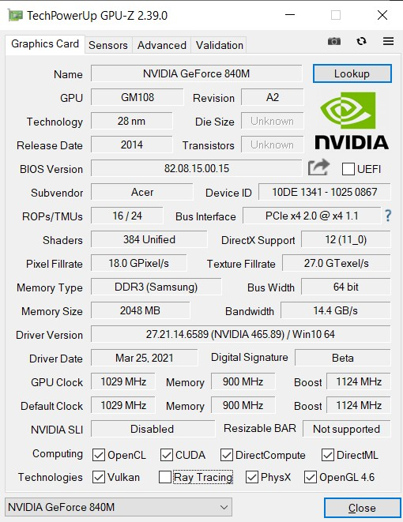
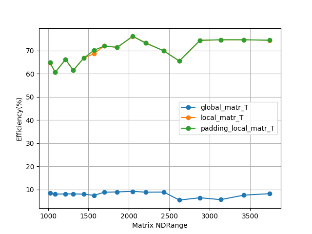
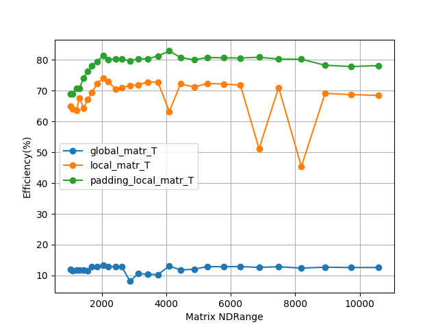

# Lab 1 
## Transpose matrix: [M x N] -> [N x M]

### Run code (Windows 10)
#### Command arguments: 
* 1: kernel file(.cl)
* 2: M
* 3: N
* 4: check (for checking results with host transpose matrix)
* 5: print (for printing result matrix)
  
#### To check results:

```
py lab2.py transpose_kernels.cl 3096 1024 check print 
```
#### To create a graphic

```
py lab2.py transpose_kernels.cl graph
```

### My GPU characteristic (NVidia 840m):


### Benchmark results:

***Here it can to see an anomaly in benchmark result as a kernel with padding give some fantastic memory bandwidth values when matrix has few elements (who knows what it means, please write ...) but after graph shows norm results***

#### Formula for computing a memory bandwidth:

$$
Effective bandwidth = (( Br + Bw ) / 109 ) / time
$$

#### Code
```
max_mem_bw = 14.4
mem_bw = ((2 * device_matr_T.nbytes / pow(1024, 3)) / (gpu_time * 1e-9)) # GB / s 
efficiency = (mem_bw  / max_mem_bw * 100)
data.update({'Mem bandwidths (GB/s)': mem_bw, 'Efficiency(%)': efficiency})
```



### Cmd results

```
Device: NVIDIA GeForce 840M:
Global mem size: 2147483648 Bytes
Local mem size: 49152 Bytes
Max CU: 3
Max work groub size: 1024 WIs

# ------------------------------- Result 1 -------------------------------
LAB 2
[1024x1024] -> [1024x1024]

Global size: (1024, 1024)
Local size: (32, 32)

{'global_matr_T': {'CPU_TIME (s)': 0.0,
                   'Compare with host': True,
                   'Efficiency(%)': 70.13035658509206,
                   'GPU_TIME (ms)': 773.60896,
                   'Mem bandwidths (GB/s)': 10.098771348253257},
 'local_matr_T': {'CPU_TIME (s)': 0.0,
                  'Compare with host': True,
                  'Efficiency(%)': 82.89091853305545,
                  'GPU_TIME (ms)': 654.51648,
                  'Mem bandwidths (GB/s)': 11.936292268759987},
 'padding_local_matr_T': {'CPU_TIME (s)': 0.0,
                          'Compare with host': True,
                          'Efficiency(%)': 85.80830109080789,
                          'GPU_TIME (ms)': 632.26368,
                          'Mem bandwidths (GB/s)': 12.356395357076337}}

# ------------------------------- Result 2 -------------------------------
LAB 2
[10240x20480] -> [20480x10240]

Global size: (20480, 10240)
Local size: (32, 32)

{'global_matr_T': {'Efficiency(%)': 57.49587295520311,
                   'GPU_TIME (ms)': 188.72127487999998,
                   'Mem bandwidths (GB/s)': 8.279405705549248},
 'local_matr_T': {'Efficiency(%)': 77.63303086304911,
                  'GPU_TIME (ms)': 139.76904319999997,
                  'Mem bandwidths (GB/s)': 11.179156444279073},
 'padding_local_matr_T': {'Efficiency(%)': 81.8385121195834,
                          'GPU_TIME (ms)': 132.58665344,
                          'Mem bandwidths (GB/s)': 11.78474574522001}}
Program work time: 18.639665603637695
